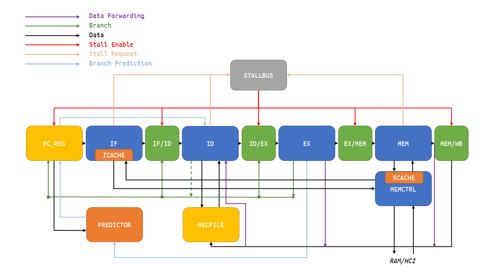

## Computer Architecture 2019 Fall project: RISC-V CPU

518030910435 杨宗翰

------

### Brief

The project is a 5-stage pipelined RISC-V ISA CPU implemented in Verilog HDL.

### Features

It is a CPU that aiming at the best speed on FPGA.

##### Cache

- $1 \text{KiB}$ Direct Mapped Instruction Cache
- $128\text{B}$ Direct Mapped Data Cache
  - Specified for stack elements, the first $128\text{B}$ part of stack is directly replaced by cache.
  - No general data cache, because D cache is actually slow on FPGA we use.

##### Quick Instruction Fetch(Fetch with prediction)

- Sequential instruction fetch takes $4$ cycles.
- The memory controller predicts instruction fetch at the second last cycle by $pc + 4$ or $pc$ depending on the type of current reading.

##### Branch Prediction

- Branch Target Buffer with index size $128$.
- Using $2\text{-bit}$ scheme making prediction for branches and `JAL`.

##### High Recursion, Division, Printing speed

- With stack cache and branch prediction, it simulates `gcd.c` with $3903\text{ns}$ using iVerilog.

##### High frequency on FPGA

- Achieved $210 \text{MHz}$.

  - Note that running with frequency over $\sim120 \text{MHz}$ will lead to UART buffer overflow in case `bulgarian.c` and `qsort.c`, longer sleep in source would help.

  - Failed on stress test, while $200 \text{MHz} $ passed stress test using $127s$ (code in *attached sheet*):

    

- Best timing of `pi.c` is around $0.54s$, using $210 \text{MHz}$ one:

  

- Best timing of `piljs.c` is $0.046875s$, using $200 \text{MHz}$ one:

  

- Best timing of `pi.c` with $100 \text{MHz}$ is  $1.2s$.

- I had handled the delays with care, including:

  - Branches calculated at EX stage.
  - Use sequential circuits instead of combinational circuits when handling cache in order to decrease bottleneck timing slack by $5ns+$.
  - Carefully designed memory controller in order to achieve a fairly good speed.

### Specification

##### Design



##### Branch

Jump at EX stage, except `JAL` (in older version) jump at ID stage. 

##### Hazard

Data forwarding : $\text{EX} \rightarrow \text{ID}, \text{MEM}\rightarrow\text{ID}$

The reason why I don't use a $*\rightarrow\text{EX}$ but $*\rightarrow\text{ID}$ is that $\text{EX}$ stage is slow, comparing with $\text{ID}, \text{EX}$ is a worse choice.

### Problems met when working on it

1. Implemented BGE with $>$.

   - It took me 2 weeks to find it out.

2. When both stalled and jumped, IF/ID and ID/EX clears wrongly.

   - It was introduced during the debugging of the last problem.

   - It took me another 2 weeks to figure it out by checking the `$display` of steps.

   - It took me another single day after ID jump was introduced.

   - I hacked a few classmates by a C source. This is a simple test which can infer if there's problem with stall and jump:

     ```c
     #include "io.h"
     int f(int x, int y);
     int g(int x, int y); // avoid tail call optimization
     int f(int x, int y) {
     	if (y == 0) return 1;
     	if (y == 1) return x;
     	return g(x, y / 2) * g(x, (y + 1) / 2);
     }
     int g(int x, int y) {
     	if (y == 0) return 1;
     	if (y == 1) return x;
     	return f(x, y / 2) * f(x, (y + 1) / 2);
     }
     int h(int x) {return x % 2 == 0 ? h(x - 1) + 1 : 0;}
     int main() {
     	for (int i = 1; i <= 6; i++) {
     		if (i % 3 == 0) {
     			outl(i); print(" ");
     		}
     		else {
     			print("# ");
     		}
     	}
     	outl(h(1)); outl(h(2));
     	outl(23456); print(" ");
     	outl(f(2, 15));
     	print("\nclock = "); outl(clock());
     }
     ```

     ```
     # # 3 # # 6 0123456 32768
     clock = [A Number Greater than 0]
     ```

     *p.s.* enable clocking in simulation requires comment something in `hci.v` like this:

     ```verilog
     assign d_cpu_cycle_cnt = /*active ? q_cpu_cycle_cnt : */q_cpu_cycle_cnt + 1'b1;
     ```

3. The first version failed on FPGA, because MEM latched so much that I can't fix.

   - I rewrote the MEM, MCTL, IF to solve this problem.
   - During the reconstruction I inspect my code and carefully handled all the known drawbacks, so I can have a good speed on FPGA at last.

4. When I tried to find a way to fetch in $4$ cycles, I failed with $7, 8, $ or even $10$ cycles.

   - Since we need to predict and correct wrong prediction as soon as possible, the signal interactions must be carefully designed - or it will fail.

5. `assign rst = rst_in | (~rdy_in);`

6. `ram_data_o  <= {24'h0,sdata[ram_addr_i[``SCacheIndex] + 1],sdata[ram_addr_i[``SCacheIndex]]};`

   - Note that it contains a 40 Byte output for a word
   - ... but it only failed during running testcases like `bulgarian.c`

7. **riscv_top.v acts wrongly**. Let me describe as follow:

   - At the posedge of cycle $0$, MCTL send a request in order to access RAM or I/O.

   - At the posedge of cycle $1$, TOP access RAM or I/O(HCI) by the higher $2$ bits of address.

   - At the posedge of cycle $2$, TOP return the data by the type **REQUESTED IN CYCLE** $1$(**should be cycle** $0$).

   - The solution to this problem is changing the MUX (more precisely, `hci_io_en`) from combinational circuits into sequential circuits, which will precisely introduce a $1$ clock delay.

   - I didn't change the `hci.v` in my file since it's not for debugging purpose, and there's comment:

     `modification allowed for debugging purposes`
   
8. `pi.c` **WRONG ANSWER**.

   ```cpp
   31415926535897932384626433832795288...
   ```

   should be

   ```cpp
   314159265358979323846264338327950288...
   ```

   because the origin program uses `%04d` but `pi.c` uses `outl`. 

### Acknowledgement

- Special thanks to 李照宇 for his guidance of Verilog, Vivado and FPGA, and helped and listened to me with a huge number of strange problems I met for a long time.
- Thanks to 张志成, 于峥 for their help of setting up FPGA.
- Thanks to 陈伟哲 for his references of understanding of 5-stage pipelined CPU.
- Thanks to 姚远 for his inspiration of branch predictor.
- Thanks to a lot of other classmates for discussing details.
- Thanks to 雷思磊 for his great《自己动手写 CPU》.

### Attached Sheet

Thanks 于峥 for this code.

```c
#include "io.h"
#define putchar outb
float f(float x, float y, float z) {
    float a = x * x + 9.0f / 4.0f * y * y + z * z - 1;
    return a * a * a - x * x * z * z * z - 9.0f / 80.0f * y * y * z * z * z;
}

float h(float x, float z) {
    for (float y = 1.0f; y >= 0.0f; y -= 0.001f)
        if (f(x, y, z) <= 0.0f)
            return y;
    return 0.0f;
}

float mysqrt(float x) {
  if (x == 0) return 0;
  int i;
  double v = x / 2;
  for (i = 0; i < 50; ++i)
    v = (v + x / v)/2;
  
  return v;
}

int main() {
    for (float z = 1.5f; z > -1.5f; z -= 0.05f) {
        for (float x = -1.5f; x < 1.5f; x += 0.025f) {
            float v = f(x, 0.0f, z);
            if (v <= 0.0f) {
                float y0 = h(x, z);
                float ny = 0.01f;
                float nx = h(x + ny, z) - y0;
                float nz = h(x, z + ny) - y0;
                float nd = 1.0f / mysqrt(nx * nx + ny * ny + nz * nz);
                float d = (nx + ny - nz) * nd * 0.5f + 0.5f;
                int index = (int)(d * 5.0f);
                putchar(".:-=+*#%@"[index]);
            }
            else
                putchar('_');
            //sleep(1);
        }
        putchar('\n');
    }
}
```

